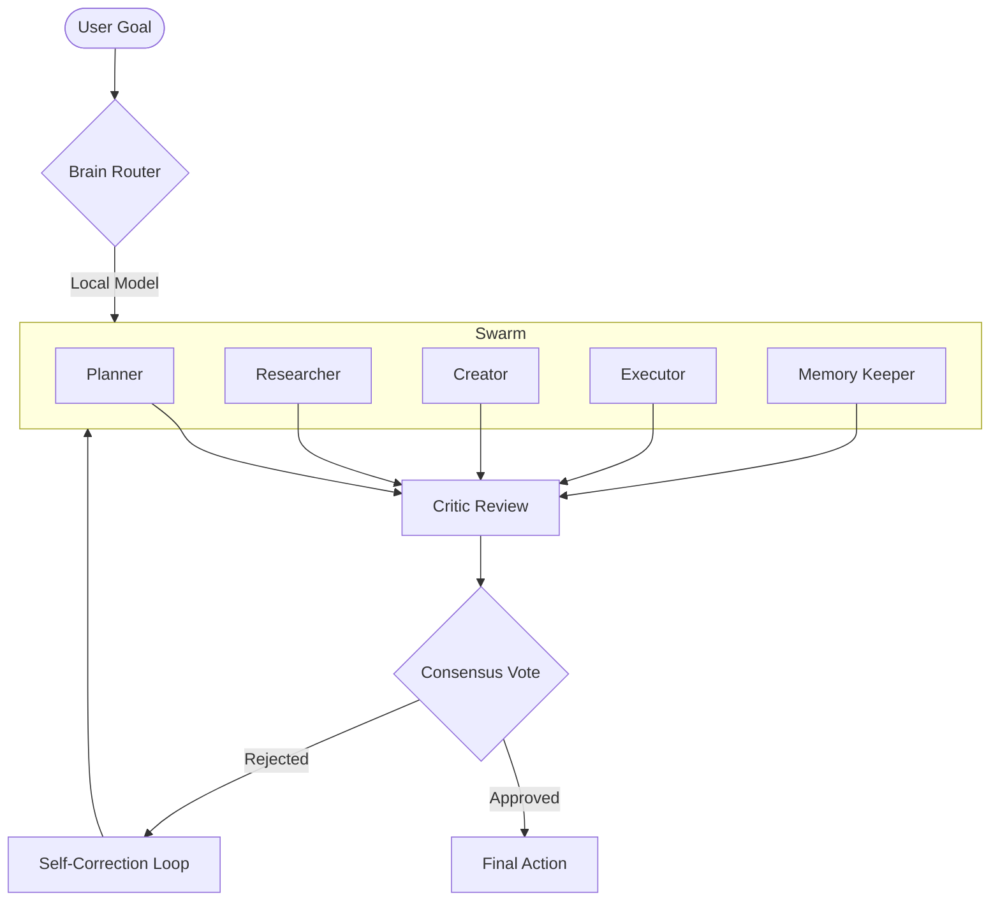

# 🏛️ HiveMind Architecture: Distributed Swarm Intelligence

HiveMind is not just a multi-agent framework; it's a **Consensus-Driven Orchestration Kernel**. This document details the technical implementation that brings HiveMind to the top tier of agentic systems.

## 🧬 The Orchestration Core

At the heart of HiveMind is a non-linear execution graph. Unlike simple sequential chains, HiveMind deploys agents in specialized parallel tracks, synthesized by a central Consensus Engine.

### 1. Swarm Execution Flow

### 2. Consensus Voting Engine
The **Consensus Facilitator** is a specialized chain that reviews the outputs of all agents. It scores alignment on a 0-100 scale. If the `agreementScore` falls below a threshold (default 70), the swarm triggers a "Debate" phase where agents must defend or revise their proposals based on the Critic's feedback.

### 3. Dual-Tier Memory Persistence
HiveMind solves the "Agent Amnesia" problem using a tiered approach:
- **L1: Structured Context (SQLite)**: Precise logging of decisions, timestamps, and confidence scores. Used for Decision Replay.
- **L2: Semantic Vector Store (ChromaDB)**: High-dimensional embeddings used for associative recall across projects.

## 🛠️ Technical Specifications

| Component | Technology | Role |
|-----------|------------|------|
| **Kernel** | Rust (Tauri) | Process management, SQLite, Low-level system access |
| **Orchestrator** | TypeScript (LangChain) | Chain composition, Event emission, Swarm logic |
| **Inference** | Ollama | Local LLM hosting (Gemma 2 / Llama 3) |
| **Frontend** | React + @xyflow | Visualization, State management, Premium UI |

## 🧩 Extension System (Plugins)

Developers can extend the swarm by adding new personas to `src/lib/chains.ts`. Each persona defines a role, system prompt, and visual accent colors that are automatically picked up by the **SwarmGraph** visualizer.

## 🚀 Performance Benchmarks
- **Cold Start**: < 2.5s (Ollama service initialization)
- **Swarm Latency**: Parallelized agent execution reduces total wall time by ~60% compared to sequential chains.
- **Memory Overhead**: < 150MB (excluding LLM weights).

---
*HiveMind is designed for developers who want to push the boundaries of what is possible with local-first AI.*
