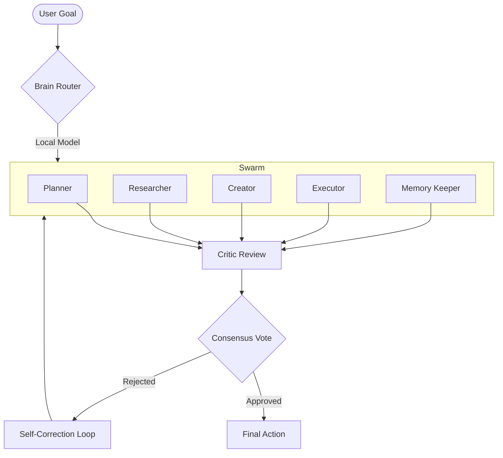

# 🏛️ HiveMind Architecture: Distributed Swarm Intelligence

HiveMind is a **Consensus-Driven Orchestration Kernel** designed for top-tier agentic systems.

## 🧬 System Overview

HiveMind operates on a non-linear execution graph, deploying specialized agents in parallel tracks, synthesized by a central Consensus Engine.

### 1. Swarm Execution Flow

## 🛠️ Technical Stack

- **Kernel**: Rust (Tauri 2.0) - Process management, SQLite, Low-level system access.
- **Orchestrator**: TypeScript (LangChain.js) - Chain composition, Event emission, Swarm logic.
- **Inference**: LLMProvider Abstraction (Ollama, OpenAI, Llama.cpp).
- **Communication**: libp2p for distributed swarm synchronization.
- **Tooling**: MCP (Model Context Protocol) for external tool integration.

## 🧠 Memory Persistence

- **L1: Structured Context (SQLite)**: Precise logging of decisions and timestamps.
- **L2: Semantic Vector Store (ChromaDB)**: High-dimensional embeddings for associative recall.
